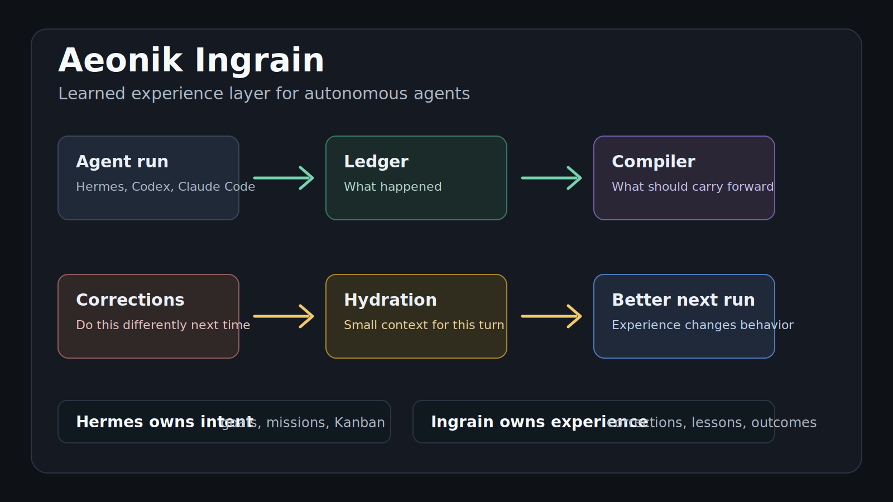
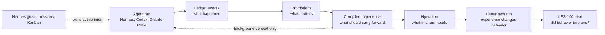

# Aeonik Ingrain

Put agents into practice.

**Learned experience for autonomous agents.**

Ingrain turns live agent runs, corrections, decisions, and repeated work into behavior that carries forward across sessions.



```bash
pipx install "git+https://github.com/aeonik-ai/ingrain.git"
ingrain init
ingrain eval
ingrain demo correction
```

```text
Aeonik Ingrain LES-100 Eval

Cold-start project recall     20/20
Correction carry-forward      20/20
Stale-plan avoidance          20/20
Track-record query            20/20
Context compactness           20/20

Total                         100/100
```

## Why

Agents have context windows, chat search, and retrieval tools. They still often start the next run like nothing important happened.

They forget corrections. They revive stale plans. They remember facts without knowing which ones are current. They can search old transcripts, but they still have to rediscover what mattered.

Ingrain is for the layer after recall:

> Logs are what happened. Learned experience is what should change next time.

## What Ingrain Learns From

Ingrain records agent work into a local event ledger, promotes durable lessons, compiles readable markdown, and hydrates future turns with compact context.

It is built for:

- user corrections
- project decisions
- current project rules
- stale plan avoidance
- repeated failures
- completed outcomes
- track-record reports
- source-linked auditability

It is not a vector database, a doc store, or a replacement for your runner agent.

## Quick Start

Current GitHub install:

```bash
pipx install "git+https://github.com/aeonik-ai/ingrain.git"
cd your-project
ingrain init
ingrain remember --type correction "Do not announce unapproved features as shipped. Offer approval-safe alternatives."
ingrain compile
ingrain hydrate --query "draft the launch post"
```

After the PyPI release:

```bash
pipx install aeonik-ingrain
```

The hydration output is fenced as background learned experience, not a new user command.

## Hermes Setup

Ingrain has two Hermes modes.

### Sidecar Mode

Sidecar mode keeps your current Hermes memory provider, including OpenViking:

```bash
ingrain ingest hermes
ingrain compile
ingrain hydrate --query "what should I know before continuing this project?"
```

Use this when you want Ingrain's compiled context without changing Hermes config.

### Live Provider Mode

Live provider mode uses Hermes' current external memory-provider slot:

```bash
ingrain install hermes
hermes config set memory.provider ingrain
```

Live provider mode gives Ingrain turn-by-turn sync. Hermes currently allows one external `memory.provider` at a time, so this may replace OpenViking until Hermes supports provider chaining.

## Goals, Missions, And Kanban Boundary

Ingrain is not the source of truth for active intent.

Hermes owns:

- active goals
- missions
- Kanban columns
- scheduling
- task lifecycle
- what the agent should do next

Ingrain owns:

- corrections
- decisions
- lessons
- stale-plan warnings
- completed outcomes
- prior failures
- project rules learned from execution

Precedence rule:

If Hermes goals, missions, or Kanban say something is active, Hermes wins.
If Ingrain recalls an old plan, it is background context only.
If Ingrain has a correction or stale-plan warning, it can influence how Hermes performs the task, but it cannot create, move, close, or schedule tasks by itself.

Short version:

> Hermes owns intent. Ingrain owns experience.
> Kanban decides what is active. Ingrain remembers what was learned.

## How Ingrain Relates To OpenViking

OpenViking and Ingrain solve different problems.

OpenViking is excellent for external knowledge and resource memory: docs, references, browsable material, and semantic retrieval.

Ingrain is for learned experience from agent runs: corrections, decisions, project rules, stale plans, repeated failures, and completed outcomes.

| Need | Best tool |
|---|---|
| Search docs/resources | OpenViking |
| Browse external knowledge | OpenViking |
| Large semantic knowledge base | OpenViking |
| Remember user corrections | Ingrain |
| Avoid stale plans | Ingrain |
| Carry project decisions forward | Ingrain |
| Track completed outcomes | Ingrain |

Use OpenViking when your bottleneck is knowledge retrieval.
Use Ingrain when your bottleneck is behavioral carry-forward.

Provider chaining is on the roadmap so Ingrain can handle learned experience while OpenViking handles resource retrieval.

## LES-100

`ingrain eval` runs a deterministic local eval called **LES-100**, the Learned Experience Score.

It checks whether Ingrain can:

- recover project facts after a cold start
- carry corrections forward
- avoid stale plans
- report completed outcomes
- keep hydration compact and relevant

The v0 eval requires no API key and no LLM.

The same command also prints a deterministic substrate comparison: Hermes default memory, Hermes + OpenViking-style retrieval, and Hermes + Ingrain. The OpenViking row is a local retrieval baseline, not a live server benchmark.

For a live OpenViking resource-retrieval check, run a local OpenViking server and then:

```bash
ingrain compare --live-openviking --openviking-endpoint http://127.0.0.1:1933
```

This uses real OpenViking upload, indexing, search, and read endpoints. It does not exercise OpenViking's LLM memory extraction unless your OpenViking server has model credentials configured.

See [docs/evals.md](docs/evals.md).
Launch copy and demo framing live in [docs/launch.md](docs/launch.md).
Current Hermes compatibility is mapped in [docs/hermes-current-map.md](docs/hermes-current-map.md).

## How It Works



```text
agent run
  -> ledger events          what happened
  -> promotions             what matters
  -> compiled markdown      what should carry forward
  -> hydration              what this turn needs
  -> LES-100 eval           whether it improved the substrate
```

Local project state:

```text
.ingrain/
  mind.db
  compiled/
    index.md
    projects.md
    decisions.md
    corrections.md
    lessons.md
    track-record.md
  evals/
```

The ledger uses Aeonik MIND's canonical event vocabulary where possible:

```text
artifact, interaction, observation, action, decision, plan, goal, reflection,
metric, experiment, chunk
```

Corrections are not a ledger event type. They are promoted learned experience.

## Safety And Privacy

Ingrain is local-first.

- no network calls by default
- no LLM calls by default
- no hosted service required
- redacts common secrets before storage
- does not store chain-of-thought
- does not mutate Hermes goals, missions, Kanban, scheduling, or task lifecycle
- includes source event IDs in compiled pages

## Commands

```bash
ingrain init
ingrain remember --type correction "Never use yellow CTAs in enterprise demos."
ingrain demo banana
ingrain compare
ingrain compare --live-openviking --openviking-endpoint http://127.0.0.1:1933
ingrain ingest hermes
ingrain compile
ingrain hydrate --query "review this launch copy"
ingrain eval
ingrain report
ingrain doctor
ingrain install hermes
```

## The Banana Test

Correct the agent once. Kill the session. Start fresh. Ask it to do related work.

If the correction carries forward without replaying the transcript, learned experience is working.

## Roadmap

- provider chaining with OpenViking-style retrieval providers
- Claude Code and Codex transcript adapters
- optional LLM-assisted promotion
- hosted Aeonik MIND backend
- team/project shared learned experience
- richer LES behavioral evals

## Status

Alpha. Useful enough to test the idea, small enough to audit.
