# Aeonik Ingrain

Put agents into practice.

**Learned experience layer for autonomous agents.**

Ingrain turns live agent runs, corrections, decisions, and repeated work into behavior that carries forward across sessions.


Animated launch visual: [assets/ingrain-flow-animated.svg](assets/ingrain-flow-animated.svg)

```bash
pipx install "git+https://github.com/aeonik-ai/ingrain.git"
ingrain attach --agent codex
ingrain hydrate --level brief --query "what should I know before this task?"
```

```text
Aeonik Ingrain LES-Core Smoke Eval

Cold-start project recall     20/20
Correction carry-forward      20/20
Stale-plan avoidance          20/20
Track-record query            20/20
Context compactness           20/20

Total                         100/100

Interpretation: local regression gate passed.
Not an external benchmark or provider leaderboard.

Practice layer checks
PRACTICE.md generated                        pass
Practice cards generated                     pass
Brief hydration generated                    pass
Evidence hydration includes confidence       pass
```

## Why

Agents have context windows, chat search, and retrieval tools. They still often start the next run like nothing important happened.

They forget corrections. They revive stale plans. They remember facts without knowing which ones are current. They can search old transcripts, but they still have to rediscover what mattered.

Ingrain is for the layer after recall:

> Logs are what happened. Learned experience is what should change next time.

## What Ingrain Learns From

Ingrain records agent work into a local event ledger, promotes durable lessons, compiles readable markdown, and hydrates future turns with compact context.

It is built for:

- user corrections
- project decisions
- current project rules
- stale plan avoidance
- repeated failures
- completed outcomes
- track-record reports
- source-linked auditability

It is not a vector database, a doc store, or a replacement for your runner agent.

## Quick Start

Current GitHub install:

```bash
pipx install "git+https://github.com/aeonik-ai/ingrain.git"
cd your-project
ingrain init
ingrain remember --type correction "Do not announce unapproved features as shipped. Offer approval-safe alternatives."
ingrain practice
ingrain hydrate --query "draft the launch post"
```

After the PyPI release:

```bash
pipx install aeonik-ingrain
```

The hydration output is fenced as background learned experience, not a new user command.

## CLI + Skill Setup

The lowest-friction adoption path is CLI + Skill:

```bash
ingrain attach --agent codex
```

That initializes local storage, writes `PRACTICE.md`, creates source-linked practice cards under `.ingrain/practice/cards/`, and installs an agent skill. Supported skill targets:

```bash
ingrain skill install codex
ingrain skill install claude
ingrain skill install cursor
ingrain skill install generic
```

Use `--target-dir` to write the skill somewhere explicit:

```bash
ingrain skill install codex --target-dir ./.ingrain/skills/ingrain
```

The generated skill teaches agents to:

- hydrate before meaningful work
- remember durable corrections, decisions, lessons, and completed outcomes
- refresh `PRACTICE.md`
- avoid storing active goals, missions, Kanban state, transient todos, secrets, or chain-of-thought

Tiered hydration:

```bash
ingrain hydrate --level brief --query "small context"
ingrain hydrate --level cards --query "normal agent context"
ingrain hydrate --level evidence --query "audit source-linked context"
```

## Hermes Setup

Ingrain has two Hermes modes.

### Sidecar Mode

Sidecar mode keeps your current Hermes memory provider, including OpenViking:

```bash
ingrain ingest hermes
ingrain compile
ingrain hydrate --query "what should I know before continuing this project?"
```

Use this when you want Ingrain's compiled context without changing Hermes config.

### Live Provider Mode

Live provider mode uses Hermes' current external memory-provider slot:

```bash
ingrain install hermes
hermes config set memory.provider ingrain
```

Live provider mode gives Ingrain turn-by-turn sync. Hermes currently allows one external `memory.provider` at a time, so this may replace OpenViking until Hermes supports provider chaining.

## Goals, Missions, And Kanban Boundary

Ingrain is not the source of truth for active intent.

Hermes owns:

- active goals
- missions
- Kanban columns
- scheduling
- task lifecycle
- what the agent should do next

Ingrain owns:

- corrections
- decisions
- lessons
- stale-plan warnings
- completed outcomes
- prior failures
- project rules learned from execution

Precedence rule:

If Hermes goals, missions, or Kanban say something is active, Hermes wins.
If Ingrain recalls an old plan, it is background context only.
If Ingrain has a correction or stale-plan warning, it can influence how Hermes performs the task, but it cannot create, move, close, or schedule tasks by itself.

Short version:

> Hermes owns intent. Ingrain owns experience.
> Kanban decides what is active. Ingrain remembers what was learned.

## How Ingrain Relates To OpenViking

OpenViking and Ingrain solve different problems.

OpenViking is excellent for external knowledge and resource memory: docs, references, browsable material, and semantic retrieval.

Ingrain is for learned experience from agent runs: corrections, decisions, project rules, stale plans, repeated failures, and completed outcomes.

| Need | Suggested tool |
|---|---|
| Search docs/resources | OpenViking |
| Browse external knowledge | OpenViking |
| Large semantic knowledge base | OpenViking |
| Remember user corrections | Ingrain |
| Avoid stale plans | Ingrain |
| Carry project decisions forward | Ingrain |
| Track completed outcomes | Ingrain |

Use OpenViking when your bottleneck is knowledge retrieval.
Use Ingrain when your bottleneck is behavioral carry-forward.

Provider chaining is on the roadmap so Ingrain can handle learned experience while OpenViking handles resource retrieval.

## Evals

`ingrain eval` runs a deterministic local smoke eval called **LES-Core**.

LES stands for **Learned Experience Score**. The default CLI still reports a 100-point local regression score for compatibility, but the public interpretation is now stricter: this is a regression gate, not a benchmark headline.

It checks whether Ingrain can:

- recover project facts after a cold start
- carry corrections forward
- avoid stale plans
- report completed outcomes
- keep hydration compact and relevant

The v0 eval requires no API key and no LLM.

The default `100/100` is expected for the committed v0 local suite. It means the current compiler and hydration rules pass the launch scenarios in this repo: project recall, correction carry-forward, stale-plan avoidance, track-record recall, and compactness. It is a regression gate for the repo's launch behaviors, not an external benchmark, provider leaderboard, or claim that Ingrain has solved all agent memory problems.

For live evidence against the installed Hermes provider API, run the live LES provider eval:

```bash
ingrain live-eval
```

The current live run is committed under `docs/evidence/live-les-provider-matrix/`. It sends the same preregistered universes through Hermes default memory, the Ingrain Hermes provider, real Hindsight local embedded mode, and the real Hermes OpenViking provider against a healthy local OpenViking server. Current scores: Hermes default `88/100`, Ingrain `100/100`, Hindsight `62/100`, Hermes OpenViking provider `30/100`.

For the benchmark posture and external standards, see [docs/eval-standards.md](docs/eval-standards.md). The short version: LES-Core and LES-Hard are Ingrain self-evals; provider claims require real provider runs or external benchmarks such as LongMemEval, LoCoMo, BEAM, LongMemEval-V2, or EvoMemBench.

For a harder local benchmark with room to improve, run:

```bash
ingrain les-hard
```

The current LES-Hard v0 result is committed under `docs/evidence/les-hard-v0/`: Ingrain scores `542/560` across 28 preregistered scenarios. It is an Ingrain self-eval, not a provider comparison.

For a live OpenViking resource-retrieval check, run a local OpenViking server and then:

```bash
ingrain compare --openviking-endpoint http://127.0.0.1:1933
```

This uses real OpenViking upload, indexing, search, and read endpoints. The current direct resource-retrieval result is `88/100` and is committed under `docs/evidence/live-openviking-resource/`. It does not claim to exercise OpenViking's LLM memory extraction path.

See [docs/evals.md](docs/evals.md).
Learned-experience results live in [docs/learned-experience-results.md](docs/learned-experience-results.md).
CLI + Skill details live in [docs/cli-skill.md](docs/cli-skill.md).
Launch copy and demo framing live in [docs/launch.md](docs/launch.md).
Visual demo notes live in [docs/visual-demo.md](docs/visual-demo.md).
Current Hermes compatibility is mapped in [docs/hermes-current-map.md](docs/hermes-current-map.md).
Hermes memory-provider positioning lives in [docs/hermes-memory-provider-comparison.md](docs/hermes-memory-provider-comparison.md).

## How It Works

```mermaid
flowchart LR
    A["Agent run<br/>Hermes, Codex, Claude Code"] --> B["Ledger events<br/>what happened"]
    B --> C["Promotions<br/>what matters"]
    C --> D["Practice cards<br/>source-linked lessons"]
    D --> E["PRACTICE.md<br/>human-readable artifact"]
    E --> F["Hydration<br/>brief, cards, evidence"]
    F --> S["Agent skill<br/>Codex, Claude, Cursor"]
    S --> G["Better next run<br/>experience changes behavior"]
    G --> H2["LES-Core eval<br/>did experience carry forward?"]

    H["Hermes goals, missions, Kanban"] -. "owns active intent" .-> A
    E -. "background context only" .-> A
```



```text
agent run
  -> ledger events          what happened
  -> promotions             what matters
  -> practice cards         source-linked lessons
  -> PRACTICE.md            human-readable learned experience
  -> skill + hydration      what this turn needs
  -> LES-Core eval          whether experience carried forward
```

Local project state:

```text
.ingrain/
  mind.db
  practice/
    cards/
  compiled/
    index.md
    projects.md
    decisions.md
    corrections.md
    lessons.md
    track-record.md
  evals/
./PRACTICE.md
```

The ledger uses Aeonik MIND's canonical event vocabulary where possible:

```text
artifact, interaction, observation, action, decision, plan, goal, reflection,
metric, experiment, chunk
```

Corrections are not a ledger event type. They are promoted learned experience.

## Safety And Privacy

Ingrain is local-first.

- no network calls by default
- no LLM calls by default
- no hosted service required
- redacts common secrets before storage
- does not store chain-of-thought
- does not mutate Hermes goals, missions, Kanban, scheduling, or task lifecycle
- includes source event IDs in compiled pages and practice cards

## Commands

```bash
ingrain init
ingrain remember --type correction "Never use yellow CTAs in enterprise demos."
ingrain demo banana
ingrain compare
ingrain les-hard
ingrain live-eval
ingrain compare --openviking-endpoint http://127.0.0.1:1933
ingrain ingest hermes
ingrain compile
ingrain practice
ingrain hydrate --query "review this launch copy"
ingrain hydrate --level brief --query "review this launch copy"
ingrain skill install codex
ingrain attach --agent codex
ingrain eval
ingrain report
ingrain doctor
ingrain install hermes
```

## The Banana Test

Correct the agent once. Kill the session. Start fresh. Ask it to do related work.

If the correction carries forward without replaying the transcript, learned experience is working.

## Roadmap

- provider chaining with OpenViking retrieval providers
- Claude Code and Codex transcript adapters
- optional LLM-assisted promotion
- hosted Aeonik MIND backend
- team/project shared learned experience
- richer LES behavioral evals

## Status

Alpha. Useful enough to test the idea, small enough to audit.
