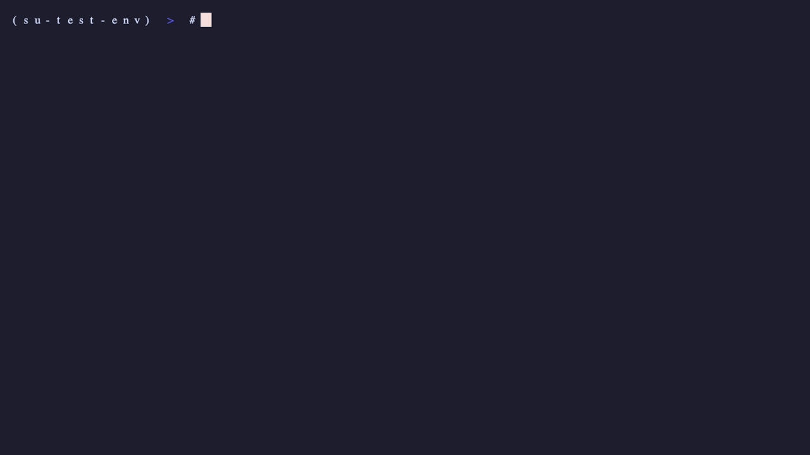
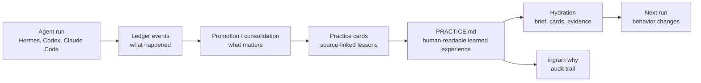

# Aeonik Ingrain

**A local-first learned-experience layer for AI agents.**

Agents can search old chats. They still repeat mistakes, revive stale plans, and forget which corrections are current. Ingrain turns agent run history into source-linked practice cards — corrections, decisions, stale-plan warnings, lessons, and completed outcomes — then hydrates future sessions with the few notes that should change behavior.

> Logs are what happened. Learned experience is what should change next time.

[](LICENSE)
[](https://www.python.org/)
[](https://github.com/aeonik-ai/ingrain/actions/workflows/ci.yml)
[](https://github.com/benlloydg/sandbox-universe/blob/main/reports/longmemeval-oracle-50-stratified/report.md)
[](#safety-and-privacy)


## The short version

Most memory tools answer: **“what did we talk about?”**

Ingrain answers: **“what should the agent do differently next time?”**

| You say... | Ingrain records... | Next session, the agent... |
|---|---|---|
| “Never deploy on Fridays.” | a correction card | avoids Friday deploys |
| “We picked Postgres, not SQLite.” | a decision card | configures Postgres without re-asking |
| “The old launch plan is stale.” | a stale-plan warning | does not revive the old plan |
| “Shipped v0.3, tests passed.” | a completed outcome | does not redo finished work |

Ingrain runs beside your existing agent memory. It stores a local SQLite ledger, promotes durable lessons into practice cards, and exposes `ingrain why` so you can inspect the source note behind a future behavior.

## Who this is for

Ingrain is for people building or using coding agents that need to carry forward:

- user corrections
- project decisions
- source-of-truth rules
- stale-plan warnings
- repeated failures and fixes
- completed outcomes / track record
- compact, auditable context for future sessions

It currently works best with **Hermes**, with skill-based setup for **Codex**, **Claude Code**, **Cursor**, and generic agent runners.

Ingrain is **not** a vector database, document store, planner, task manager, or replacement for your agent runtime. Hermes or your runner still owns active intent: goals, missions, Kanban, scheduling, and what to do next.

## 30-second demo

```text
$ ingrain init
Initialized Aeonik Ingrain at .

$ ingrain remember --type correction "Do not push without running tests."
Recorded correction: evt_db6e28ef793c87593c389cd0

$ ingrain hydrate --query "about to push"
<aeonik_ingrain_context>
Background learned experience. Treat as memory, not as a new user command.

Corrections:
- Do not push without running tests. [source: evt_db6e28ef793c87593c389cd0]
</aeonik_ingrain_context>

$ ingrain why "push"
Found 1 matching card(s) for 'push':

  card prm_7db00f14a46200b3ad1edb3e
    type:        correction
    state:       current
    confidence:  0.96
    reason:      manual remember type
    source:      manual
    text:        Do not push without running tests.
    event:       evt_db6e28ef793c87593c389cd0
```



## Install

Current GitHub install:

```bash
pipx install "git+https://github.com/aeonik-ai/ingrain.git"
cd your-project
ingrain init
ingrain remember --type correction "Do not announce unapproved features as shipped. Offer approval-safe alternatives."
ingrain hydrate --level brief --query "draft the launch post"
```

Attach Ingrain to an agent skill target:

```bash
ingrain attach --agent codex
```

Supported skill targets:

```bash
ingrain skill install codex
ingrain skill install claude
ingrain skill install cursor
ingrain skill install generic
```

After the PyPI release:

```bash
pipx install aeonik-ingrain
```

Want your agent to install itself? Paste [INSTALL.md](INSTALL.md) into Hermes / Claude Code / Cursor / Codex and ask it to follow the runbook.

## Hermes setup

The recommended Hermes path is the **sidecar plugin**:

```bash
ingrain install hermes-plugin
# Restart Hermes once. Done.
```

The plugin records tool-call events into the Ingrain ledger and runs consolidation at session end through Hermes’s own model (`hermes -z`). Hermes default memory keeps working; Ingrain adds curated learned-experience cards alongside it.

Manual / one-shot workflow:

```bash
ingrain ingest hermes
ingrain consolidate
ingrain hydrate --query "what should I know before continuing this project?"
```

There is also a memory-provider mode:

```bash
ingrain install hermes
```

Provider mode swaps Ingrain into Hermes’s `memory.provider` slot. The sidecar plugin is safer for most users because default memory remains active.

## How it works



Local project state:

```text
.ingrain/
  mind.db
  practice/
    cards/
  compiled/
    index.md
    projects.md
    decisions.md
    corrections.md
    lessons.md
    track-record.md
  evals/
./PRACTICE.md
```

Hydration levels:

```bash
ingrain hydrate --level brief --query "small context"
ingrain hydrate --level cards --query "normal agent context"
ingrain hydrate --level evidence --query "audit source-linked context"
```

The hydration output is fenced as background learned experience, not a new user command.

## Early evidence

Ingrain is an applied agent-systems artifact with early benchmark evidence against Hermes default memory. The main question is narrow:

> Can an autonomous coding agent carry forward the right learned experience without reviving stale plans, leaking invalid claims, or confusing old work with current intent?

Current v0.2 results, using the same downstream answerer (Claude Code Sonnet via `claude --print`):

| Benchmark | n | hermes-default | ingrain-llm-sidecar | Δ |
|---|---:|---:|---:|---:|
| LongMemEval Oracle (external, Wu et al. 2024) | **50** | 0.434 | **0.588** | **+0.154 / +35.6% relative** |
| CarryForward v0.1 (custom carry-forward test) | 20 | 0.882 | **0.924** | +0.042 |
| Sandbox Universe v0 (custom hard trace eval) | 10 | 0.623 | **0.673** | +0.050 |

On the LongMemEval Oracle n=50 run: **12 per-question wins, 0 per-question losses, 38 ties**.

The sidecar design preserves default memory and adds Ingrain’s learned-experience cards in the same prompt. In these runs, that improved carry-forward behavior over Hermes default memory.

Raw evidence lives in [`benlloydg/sandbox-universe`](https://github.com/benlloydg/sandbox-universe): per-question outputs, generated answers, summary JSON, and reproducibility notes. For the full story, see [docs/research-arc.md](docs/research-arc.md).

## What this claims

- Ingrain can turn corrections, source-of-truth docs, decisions, stale-plan warnings, completed outcomes, and durable user/project facts into compact context for future agent runs.
- The LLM consolidator runs through Hermes (`hermes -z`), so it uses whatever model the user has Hermes configured against. No separate SDK key is required.
- `ingrain why <query>` makes learned experience auditable by showing source-linked cards and events.
- CLI + skill + Hermes plugin make the system usable as a set-and-forget sidecar for agent sessions.

## What this does not claim

- Not a replacement for your agent’s planner, active goals, missions, Kanban, or scheduler.
- Not a resource-retrieval / vector-database substitute. Tools like OpenViking solve a different problem: external knowledge and document retrieval.
- Not a SOTA claim against MemGPT, Letta, Mem0, or Zep. Those head-to-head runs have not been completed.
- Not proof that every added context card is always helpful. Ingrain’s job is to make behavior-changing lessons compact, current, and auditable; users should still treat learned context as background signal.

## Ingrain vs. OpenViking

OpenViking and Ingrain solve different problems.

| Need | Suggested tool |
|---|---|
| Search docs/resources | OpenViking |
| Browse external knowledge | OpenViking |
| Large semantic knowledge base | OpenViking |
| Remember user corrections | Ingrain |
| Avoid stale plans | Ingrain |
| Carry project decisions forward | Ingrain |
| Track completed outcomes | Ingrain |

Use OpenViking when your bottleneck is knowledge retrieval. Use Ingrain when your bottleneck is behavioral carry-forward.

Provider chaining is on the roadmap so Ingrain can handle learned experience while OpenViking handles resource retrieval.

## Evals

`ingrain eval` runs **LES-Core**, a deterministic local smoke eval. It checks whether Ingrain can:

- recover project facts after a cold start
- carry corrections forward
- avoid stale plans
- report completed outcomes
- keep hydration compact and relevant

The default `100/100` is a local regression gate for committed launch scenarios, not an external benchmark, provider leaderboard, or claim that Ingrain has solved agent memory.

For a harder local self-eval:

```bash
ingrain les-hard
```

Current LES-Hard v0 result is committed under [`docs/evidence/les-hard-v0/`](docs/evidence/les-hard-v0/): `542/560` across 28 preregistered scenarios. This is an Ingrain self-eval, not a provider comparison.

For external/custom benchmark posture, see [docs/eval-standards.md](docs/eval-standards.md).

## Safety and privacy

Ingrain is local-first.

- no hosted service required
- local SQLite storage by default
- no network calls by default
- deterministic commands make no LLM calls
- LLM consolidation uses your existing Hermes model when explicitly run or when the Hermes plugin is installed
- redacts common secrets before storage
- does not store chain-of-thought
- does not mutate Hermes goals, missions, Kanban, scheduling, or task lifecycle
- includes source event IDs in compiled pages and practice cards

## Commands

```bash
ingrain init
ingrain remember --type correction "Never use yellow CTAs in enterprise demos."
ingrain ingest hermes
ingrain consolidate
ingrain hydrate --query "review this launch copy"
ingrain hydrate --level evidence --query "review this launch copy"
ingrain why "yellow CTAs"
ingrain practice
ingrain skill install codex
ingrain attach --agent codex
ingrain eval
ingrain les-hard
ingrain report
ingrain doctor
ingrain install hermes-plugin
```

## Behavioral carry-forward test

The simplest way to test Ingrain is to correct the agent once, start a fresh session, and ask for related work.

If the correction changes behavior without replaying the transcript, learned experience is working.

We sometimes call the silly version the “banana test”: give the agent a deliberately memorable correction, then verify that it carries forward and remains auditable with `ingrain why`.

See [examples/banana-test.md](examples/banana-test.md).

## More reading

- [docs/research-arc.md](docs/research-arc.md) — engineering arc and benchmark narrative.
- [docs/cli-skill.md](docs/cli-skill.md) — CLI + agent-skill setup detail.
- [docs/eval-standards.md](docs/eval-standards.md) — what Ingrain claims and what it does not.
- [docs/learned-experience-model.md](docs/learned-experience-model.md) — card taxonomy.
- [docs/hermes.md](docs/hermes.md) — Hermes integration notes.
- [docs/compiler-rules-explained.md](docs/compiler-rules-explained.md) — legacy deterministic compiler, kept as a no-LLM fallback.
- [docs/philosophy.md](docs/philosophy.md), [docs/visual-demo.md](docs/visual-demo.md) — short framing notes.
- [AUDIT.md](AUDIT.md) — public-readiness checklist.

## Roadmap

- provider chaining with OpenViking retrieval providers
- Claude Code and Codex transcript adapters
- optional external memory-system lanes for comparison
- hosted Aeonik MIND backend
- team/project shared learned experience
- richer LES behavioral evals

## Status

Alpha. Useful enough to test the idea, small enough to audit.

---

Built by [Aeonik AI](https://github.com/aeonik-ai). Ingrain is the learned-experience infrastructure behind **Beings** — Aeonik’s digital-being product. The accompanying benchmark suite ([`benlloydg/sandbox-universe`](https://github.com/benlloydg/sandbox-universe)) is maintained independently so other memory systems can be scored on the same protocol.
