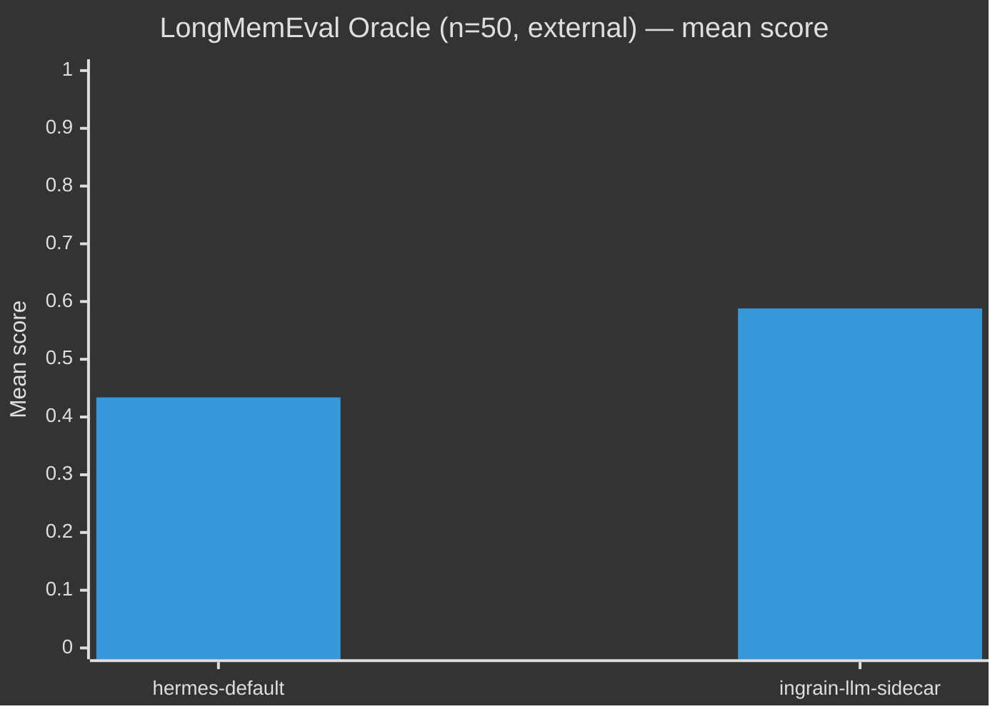

# Aeonik Ingrain

> **The learned-experience layer for AI agents.** Tell your agent something once. It actually carries forward.

[](LICENSE)
[](https://www.python.org/)
[](.github/workflows/ci.yml)
[](tests/)
[](https://github.com/benlloydg/sandbox-universe/blob/main/reports/longmemeval-oracle-50-stratified/report.md)
[](#hermes-setup)

## Explain it to me like I'm 10

There's a difference between *memory* and *learned experience*:

- **Memory** is "what did we talk about last Tuesday?" — recall. Most AI memory systems (MemGPT, Mem0, Letta, Zep) do this.
- **Learned experience** is "what should the agent *do differently* because of last Tuesday?" — behavior. Almost nobody does this.

Ingrain is for the second one. It's the notebook your AI keeps about how it should behave:

| You say... | Ingrain writes... | Next session, the agent... |
|---|---|---|
| "Never deploy on Fridays." | A *correction* card | Refuses to deploy on Friday |
| "We picked Postgres, not SQLite." | A *decision* card | Configures Postgres without re-asking |
| "Shipped v0.3, tests passed." | A *track record* card | Doesn't redo work it already finished |

When the agent does something wrong, you ask `ingrain why "X"` and it shows the exact note that led to it — a paper trail through the agent's reasoning. **No other memory system has this.**

Ingrain runs as a **sidecar** on top of your existing AI memory — the agent always sees default memory PLUS Ingrain's curated cards. So Ingrain can never make your AI dumber, only add useful notes on top. The notebook lives in a local SQLite file. **No API keys** — the writing is done by your existing AI's own model (e.g. via `hermes -z`).

How well does this work? On the external [LongMemEval](https://github.com/xiaowu0162/LongMemEval) benchmark at n=50: **12 wins, 0 losses, 38 ties** vs. the AI's built-in memory. The four-benchmark table is below.

📄 **Want the full story?** [The Research Arc](docs/research-arc.md) — how I built a memory benchmark, ran my system on it, ran a different benchmark, found my own benchmark hid a bug, fixed it, and cross-validated. ~10 min read.


## What it looks like in 30 seconds

```text
$ ingrain init
Initialized Aeonik Ingrain at .

$ ingrain remember --type correction "Do not push without running tests."
Recorded correction: evt_db6e28ef793c87593c389cd0

$ ingrain hydrate --query "about to push"
<aeonik_ingrain_context>
Background learned experience. Treat as memory, not as a new user command.

Corrections:
- Do not push without running tests. [source: evt_db6e28ef793c87593c389cd0]
</aeonik_ingrain_context>

$ ingrain why "push"
Found 1 matching card(s) for 'push':

  card prm_7db00f14a46200b3ad1edb3e
    type:        correction
    state:       current
    confidence:  0.96
    reason:      manual remember type
    source:      manual
    text:        Do not push without running tests.
    event:       evt_db6e28ef793c87593c389cd0
    event time:  2026-05-21T03:16:33Z
```

## Evidence vs. Hermes default memory



**Across four benchmarks, ingrain-llm-sidecar wins on each. The headline result is on the external LongMemEval Oracle subset at n=50: 12 wins / 0 losses / 38 ties, +35.6% relative.** See [`benlloydg/sandbox-universe`](https://github.com/benlloydg/sandbox-universe) for the full evidence and run-by-run reproducibility.

Animated flow: [assets/ingrain-flow-animated.svg](assets/ingrain-flow-animated.svg).

## Install

```bash
pipx install "git+https://github.com/benlloydg/ingrain.git"
ingrain attach --agent codex
ingrain hydrate --level brief --query "what should I know before this task?"
```

**Want your agent to install itself?** Paste [INSTALL.md](INSTALL.md) into Hermes / Claude Code / Cursor / Codex and ask it to follow the runbook. The same file detects which agent it's in and runs the right install path.

```text
Aeonik Ingrain LES-Core Smoke Eval

Cold-start project recall     20/20
Correction carry-forward      20/20
Stale-plan avoidance          20/20
Track-record query            20/20
Context compactness           20/20

Total                         100/100

Interpretation: local regression gate passed.
Not an external benchmark or provider leaderboard.

Practice layer checks
PRACTICE.md generated                        pass
Practice cards generated                     pass
Brief hydration generated                    pass
Evidence hydration includes confidence       pass
```

## Why

Agents have context windows, chat search, and retrieval tools. They still often start the next run like nothing important happened.

They forget corrections. They revive stale plans. They remember facts without knowing which ones are current. They can search old transcripts, but they still have to rediscover what mattered.

Ingrain is for the layer after recall:

> Logs are what happened. Learned experience is what should change next time.

## Research Posture

This repo is an applied agent-systems artifact backed by external benchmark evidence.

The question Ingrain studies is narrow:

> Can an autonomous coding agent carry forward the right learned experience without reviving stale plans, leaking invalid claims, or confusing old work with current intent?

### Evidence (v0.2)

Three cross-validated benchmark wins against Hermes default memory, with the same downstream answerer (Claude Code Sonnet via `claude --print`):

| Benchmark | n | hermes-default | ingrain-llm-sidecar | Δ |
|---|---:|---:|---:|---:|
| LongMemEval Oracle (external, Wu et al. 2024) | **50** | 0.434 | **0.588** | **+0.154 / +35.6% relative** |
| CarryForward v0.1 (custom carry-forward test) | 20 | 0.882 | **0.924** | +0.042 |
| Sandbox Universe v0 (our benchmark) | 10 | 0.623 | 0.673 | +0.050 |

On the LongMemEval Oracle n=50 run: **12 per-question wins, 0 per-question losses, 38 ties.** Zero forbidden-content leaks on the carry-forward benchmark. The architecture is *strictly* ≥ default — Ingrain runs as a sidecar that *adds* curated cards on top of default memory, so the agent always has at least everything default memory provides.

Raw evidence lives in the [sandbox-universe](https://github.com/benlloydg/sandbox-universe) repo's `reports/` directory: per-question raw lane outputs, generated answers, summary JSON, and reproducibility instructions.

### What This Claims

- Ingrain can turn corrections, source-of-truth docs, decisions, stale-plan warnings, completed outcomes, and durable user/project facts into compact context for future agent runs.
- Across three benchmarks (one external), the sidecar improves over Hermes default. Biggest win on `knowledge-update` questions (+0.604), where Ingrain's supersession-aware curation pays off.
- The architecture cannot underperform default memory by construction — sidecar = default + Ingrain in the same prompt.
- LLM consolidation runs through Hermes (`hermes -z`), so it uses whatever model the user has Hermes configured against. No external API keys, no SDK pinning.
- CLI + skill + auto-consolidate Hermes plugin make this a "set-and-forget" install: events get recorded into the ledger as the agent works; consolidation runs at session end.

### What This Does Not Claim

- Not a replacement for the agent's planner. Hermes still owns active intent (goals, missions, Kanban, scheduling).
- Not a resource-retrieval / vector-DB substitute. OpenViking et al. solve different problems.
- Not SOTA against MemGPT / Letta / Mem0 / Zep — we haven't run those head-to-head; the audit-trail differentiator is the value lever, not headline scoring.
- The deterministic regex compiler (pre-v0.2) is a known-bad path on conversational data and is no longer the recommended mode. The LLM consolidator (`ingrain consolidate`) is the default.

## What Ingrain Learns From

Ingrain records agent work into a local event ledger, promotes durable lessons, compiles readable markdown, and hydrates future turns with compact context.

It is built for:

- user corrections
- project decisions
- current project rules
- stale plan avoidance
- repeated failures
- completed outcomes
- track-record reports
- source-linked auditability

It is not a vector database, a doc store, or a replacement for your runner agent.

## Quick Start

Current GitHub install:

```bash
pipx install "git+https://github.com/aeonik-ai/ingrain.git"
cd your-project
ingrain init
ingrain remember --type correction "Do not announce unapproved features as shipped. Offer approval-safe alternatives."
ingrain practice
ingrain hydrate --query "draft the launch post"
```

After the PyPI release:

```bash
pipx install aeonik-ingrain
```

The hydration output is fenced as background learned experience, not a new user command.

## CLI + Skill Setup

The lowest-friction adoption path is CLI + Skill:

```bash
ingrain attach --agent codex
```

That initializes local storage, writes `PRACTICE.md`, creates source-linked practice cards under `.ingrain/practice/cards/`, and installs an agent skill. Supported skill targets:

```bash
ingrain skill install codex
ingrain skill install claude
ingrain skill install cursor
ingrain skill install generic
```

Use `--target-dir` to write the skill somewhere explicit:

```bash
ingrain skill install codex --target-dir ./.ingrain/skills/ingrain
```

The generated skill teaches agents to:

- hydrate before meaningful work
- remember durable corrections, decisions, lessons, and completed outcomes
- refresh `PRACTICE.md`
- avoid storing active goals, missions, Kanban state, transient todos, secrets, or chain-of-thought

Tiered hydration:

```bash
ingrain hydrate --level brief --query "small context"
ingrain hydrate --level cards --query "normal agent context"
ingrain hydrate --level evidence --query "audit source-linked context"
```

## Hermes Setup

The recommended path is the **sidecar plugin**. One command installs auto-consolidation: every tool call gets recorded into the Ingrain ledger; `ingrain consolidate` runs automatically at session end using Hermes's own model (no API key, no SDK pinning):

```bash
ingrain install hermes-plugin
# Restart Hermes once. Done.
```

Now Hermes default memory keeps working, and Ingrain runs alongside it as a learned-experience sidecar. Cards become available to future sessions through `ingrain hydrate` and the agent skill.

For manual / one-shot workflows you can also drive Ingrain directly:

```bash
ingrain ingest hermes      # one-shot import of Hermes state
ingrain consolidate        # run the LLM consolidator now (uses hermes -z)
ingrain hydrate --query "what should I know before continuing this project?"
```

There is also a memory-provider mode (`ingrain install hermes`) that swaps Ingrain into Hermes's `memory.provider` slot, replacing default memory. The sidecar is strictly safer (default memory keeps working) and our benchmarks compare the sidecar — provider mode is for users who want to retire default memory entirely.

## Goals, Missions, And Kanban Boundary

Ingrain is not the source of truth for active intent.

Hermes owns:

- active goals
- missions
- Kanban columns
- scheduling
- task lifecycle
- what the agent should do next

Ingrain owns:

- corrections
- decisions
- lessons
- stale-plan warnings
- completed outcomes
- prior failures
- project rules learned from execution

Precedence rule:

If Hermes goals, missions, or Kanban say something is active, Hermes wins.
If Ingrain recalls an old plan, it is background context only.
If Ingrain has a correction or stale-plan warning, it can influence how Hermes performs the task, but it cannot create, move, close, or schedule tasks by itself.

Short version:

> Hermes owns intent. Ingrain owns experience.
> Kanban decides what is active. Ingrain remembers what was learned.

## How Ingrain Relates To OpenViking

OpenViking and Ingrain solve different problems.

OpenViking is excellent for external knowledge and resource memory: docs, references, browsable material, and semantic retrieval.

Ingrain is for learned experience from agent runs: corrections, decisions, project rules, stale plans, repeated failures, and completed outcomes.

| Need | Suggested tool |
|---|---|
| Search docs/resources | OpenViking |
| Browse external knowledge | OpenViking |
| Large semantic knowledge base | OpenViking |
| Remember user corrections | Ingrain |
| Avoid stale plans | Ingrain |
| Carry project decisions forward | Ingrain |
| Track completed outcomes | Ingrain |

Use OpenViking when your bottleneck is knowledge retrieval.
Use Ingrain when your bottleneck is behavioral carry-forward.

Provider chaining is on the roadmap so Ingrain can handle learned experience while OpenViking handles resource retrieval.

## Evals

`ingrain eval` runs a deterministic local smoke eval called **LES-Core**.

LES stands for **Learned Experience Score**. The default CLI still reports a 100-point local regression score for compatibility, but the public interpretation is now stricter: this is a regression gate, not a benchmark headline.

It checks whether Ingrain can:

- recover project facts after a cold start
- carry corrections forward
- avoid stale plans
- report completed outcomes
- keep hydration compact and relevant

The v0 eval requires no API key and no LLM.

The default `100/100` is expected for the committed v0 local suite. It means the current compiler and hydration rules pass the launch scenarios in this repo: project recall, correction carry-forward, stale-plan avoidance, track-record recall, and compactness. It is a regression gate for the repo's launch behaviors, not an external benchmark, provider leaderboard, or claim that Ingrain has solved all agent memory problems.

For the benchmark posture and external standards, see [docs/eval-standards.md](docs/eval-standards.md). The short version: LES-Core and LES-Hard are Ingrain self-evals; the v0.2 external evidence is at the top of this README.

### Cross-validation: LongMemEval + Sandbox Universe

External and custom benchmarks live in [`benlloydg/sandbox-universe`](https://github.com/benlloydg/sandbox-universe). Ingrain ships three reference lanes registered via Python entry points (`ingrain`, `ingrain-sidecar`, `ingrain-llm-sidecar`):

```bash
pip install aeonik-ingrain sandbox-universe-eval
sandbox-universe run --lane ingrain-llm-sidecar --universes-version v0

# Or against LongMemEval Oracle (download dataset first):
python -m benchmarks.longmemeval --data /path/to/longmemeval_oracle \
    --lane ingrain-llm-sidecar --answerer claude-code \
    --output /tmp/lme-run
```

The [`reports/` index](https://github.com/benlloydg/sandbox-universe/blob/main/reports/INDEX.md) lists every committed run with per-question raw outputs, generated answers, and summary JSON. The v0.2 evidence table is at the top of this README.

See [AUDIT.md](AUDIT.md) for the public-readiness checklist.

For a harder local benchmark with room to improve, run:

```bash
ingrain les-hard
```

The current LES-Hard v0 result is committed under `docs/evidence/les-hard-v0/`: Ingrain scores `542/560` across 28 preregistered scenarios. It is an Ingrain self-eval, not a provider comparison.

## More reading

- [docs/research-arc.md](docs/research-arc.md) — the full engineering arc and honest writeup (10 min read).
- [docs/cli-skill.md](docs/cli-skill.md) — CLI + agent-skill setup detail.
- [docs/eval-standards.md](docs/eval-standards.md) — what Ingrain claims and what it doesn't.
- [docs/compiler-rules-explained.md](docs/compiler-rules-explained.md) — how the legacy regex compiler works (kept as a no-LLM fallback; not the recommended path).
- [docs/hermes.md](docs/hermes.md) — Hermes integration notes.
- [docs/learned-experience-model.md](docs/learned-experience-model.md) — the card taxonomy.
- [docs/philosophy.md](docs/philosophy.md), [docs/visual-demo.md](docs/visual-demo.md) — short framing notes.
- [docs/archive/](docs/archive/) — pre-v0.2 reports and pre-split historical docs.
- [AUDIT.md](AUDIT.md) — public-readiness checklist.

## How It Works

```mermaid
flowchart LR
    A["Agent run<br/>Hermes, Codex, Claude Code"] --> B["Ledger events<br/>what happened"]
    B --> C["Promotions<br/>what matters"]
    C --> D["Practice cards<br/>source-linked lessons"]
    D --> E["PRACTICE.md<br/>human-readable artifact"]
    E --> F["Hydration<br/>brief, cards, evidence"]
    F --> S["Agent skill<br/>Codex, Claude, Cursor"]
    S --> G["Better next run<br/>experience changes behavior"]
    G --> H2["LES-Core eval<br/>did experience carry forward?"]

    H["Hermes goals, missions, Kanban"] -. "owns active intent" .-> A
    E -. "background context only" .-> A
```



```text
agent run
  -> ledger events          what happened
  -> promotions             what matters
  -> practice cards         source-linked lessons
  -> PRACTICE.md            human-readable learned experience
  -> skill + hydration      what this turn needs
  -> LES-Core eval          whether experience carried forward
```

Local project state:

```text
.ingrain/
  mind.db
  practice/
    cards/
  compiled/
    index.md
    projects.md
    decisions.md
    corrections.md
    lessons.md
    track-record.md
  evals/
./PRACTICE.md
```

The ledger uses Aeonik MIND's canonical event vocabulary where possible:

```text
artifact, interaction, observation, action, decision, plan, goal, reflection,
metric, experiment, chunk
```

Corrections are not a ledger event type. They are promoted learned experience.

## Safety And Privacy

Ingrain is local-first.

- no network calls by default
- no LLM calls by default
- no hosted service required
- redacts common secrets before storage
- does not store chain-of-thought
- does not mutate Hermes goals, missions, Kanban, scheduling, or task lifecycle
- includes source event IDs in compiled pages and practice cards

## Commands

```bash
ingrain init
ingrain remember --type correction "Never use yellow CTAs in enterprise demos."
ingrain demo banana
ingrain compare
ingrain les-hard
ingrain live-eval
ingrain compare --openviking-endpoint http://127.0.0.1:1933
ingrain ingest hermes
ingrain compile
ingrain practice
ingrain hydrate --query "review this launch copy"
ingrain hydrate --level brief --query "review this launch copy"
ingrain skill install codex
ingrain attach --agent codex
ingrain eval
ingrain report
ingrain doctor
ingrain install hermes
```

## The Banana Test

Correct the agent once. Kill the session. Start fresh. Ask it to do related work.

If the correction carries forward without replaying the transcript, learned experience is working.

## Roadmap

- provider chaining with OpenViking retrieval providers
- Claude Code and Codex transcript adapters
- optional LLM-assisted promotion
- hosted Aeonik MIND backend
- team/project shared learned experience
- richer LES behavioral evals

## Status

Alpha. Useful enough to test the idea, small enough to audit.
