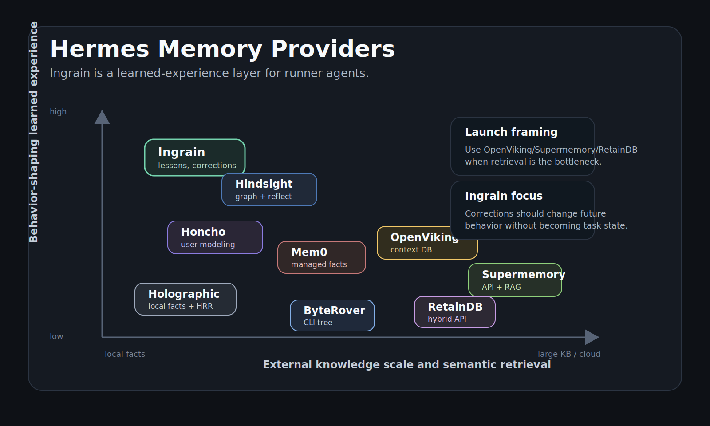

# Hermes Memory Provider Comparison

Verified against official Hermes upstream on 2026-05-19:

```text
repo: https://github.com/NousResearch/hermes-agent.git
branch: origin/main
commit: a0bd11d02 fix(tests): catch up 25 stale tests after recent merges (#28626)
```

Hermes currently ships eight external memory providers: Honcho, OpenViking, Mem0, Hindsight, Holographic, RetainDB, ByteRover, and Supermemory. Hermes built-in memory is always active, and only one external `memory.provider` can be live at a time.

Ingrain is not trying to be the biggest retrieval backend. It is the learned-experience layer: corrections, decisions, stale-plan warnings, repeated failures, completed outcomes, and project rules that should change future agent behavior.



## Executive Read

Most Hermes providers optimize recall:

- search old context
- store user facts
- retrieve documents and resources
- synthesize profile or graph context
- expose memory search/store tools

Ingrain optimizes behavioral carry-forward:

- do not repeat corrected mistakes
- do not revive stale plans
- distinguish old plans from current rules
- remember what worked, failed, or shipped
- hydrate compact learned experience without becoming active task state

That means the honest launch line is:

> Retrieval remembers what happened. Ingrain remembers what should change.

## Provider Table

| Provider | Primary job | Storage / deployment | Best at | Weak for learned experience | How Ingrain differs or pairs |
|---|---|---|---|---|---|
| Hermes built-in memory | Local curated notes via `MEMORY.md` / `USER.md` | Local files, always active | Simple always-on preferences and durable notes | Can become flat notes; no dedicated compiler for stale plans, corrections, or outcomes | Ingrain compiles structured experience and can hydrate it alongside built-in memory. |
| Honcho | Cross-session user and AI peer modeling | Honcho cloud or self-hosted service | Modeling the user, AI peer, sessions, and dialectic summaries | Strong model of who the user/agent is, but not a strict project execution ledger or Kanban-safe lesson compiler | Use Honcho for identity/persona continuity; use Ingrain for project execution lessons and corrections. |
| OpenViking | Context database for agents | Self-hosted server | Filesystem-style memory/resources/skills, tiered context loading, browsable knowledge | Excellent context DB, but learned-experience rules can mix with resources unless separated by convention | Best current pairing: OpenViking live provider for resources, Ingrain sidecar for learned experience. |
| Mem0 | Managed memory extraction and semantic recall | Mem0 cloud | Hands-off fact extraction, user/session/agent memory, reranking | Cloud/API dependency; extracted facts are not the same as deterministic stale-plan/correction precedence | Use Mem0 when managed personalization is the priority; use Ingrain when exact project lessons must carry forward. |
| Hindsight | Agent memory with graph/entity retrieval and reflect synthesis | Hindsight cloud, local embedded, or external self-hosted | Knowledge graph, entity resolution, multi-strategy retrieval, synthesis across memories | Powerful, but heavier; reflect synthesis is not the same as a small deterministic compiler with explicit intent boundaries | Closest philosophical overlap. Ingrain is smaller, local, deterministic by default, and focused on practice memory. |
| Holographic | Local fact store | Local SQLite with FTS5 and optional NumPy HRR | Zero-service local facts, trust scoring, entity/HRR-style reasoning | Fact substrate, not a full learned-experience compiler or launchable behavioral eval story | Holographic stores facts; Ingrain promotes execution experience into future behavior guidance. |
| RetainDB | Cloud memory API and hybrid search | RetainDB cloud | Persistent user/project memory, vector + BM25 + reranking, typed memories | Product memory API, not a repo-local execution ledger; requires service/account | Use RetainDB for app/user memory infra; use Ingrain for local autonomous-agent run learning. |
| ByteRover | CLI knowledge tree and federated memory search | Local-first CLI with optional cloud sync | Hierarchical project knowledge, curation, search, pre-compression extraction | Strong knowledge organization; learned-experience semantics depend on curation shape | Pair when you want ByteRover's knowledge tree and Ingrain's explicit correction/lesson compiler. |
| Supermemory | Memory/context API with RAG, profiles, connectors | Supermemory cloud/API | Profile recall, hybrid memory + documents, connectors, file processing, containers | Broad context stack; not specifically a local project-run lesson ledger | Use Supermemory for product-grade context API/RAG; use Ingrain for agent practice memory. |
| Ingrain | Learned experience for autonomous agents | Local SQLite ledger + compiled markdown; sidecar or provider slot | Corrections, decisions, stale-plan avoidance, track record, compact hydration | Not a large vector DB, doc store, or general RAG system | Use as sidecar with retrieval providers today; use provider mode when learned experience is the bottleneck. |

## Capability Matrix

Qualitative read from the official Hermes provider docs and each provider's public docs/repo. This is not a universal benchmark.

| Capability | Built-in | Honcho | OpenViking | Mem0 | Hindsight | Holographic | RetainDB | ByteRover | Supermemory | Ingrain |
|---|---|---|---|---|---|---|---|---|---|---|
| Local-first / no hosted account | Strong | Partial | Strong | No | Partial | Strong | No | Strong | No | Strong |
| Semantic search / retrieval | Limited | Good | Strong | Strong | Strong | Good | Strong | Strong | Strong | Limited |
| Large docs/resources | Limited | Limited | Strong | Limited | Good | Limited | Good | Good | Strong | No |
| User profile modeling | Good | Strong | Good | Strong | Good | Limited | Strong | Limited | Strong | Limited |
| Knowledge graph / entity reasoning | No | Good | Good | Good | Strong | Good | Limited | Limited | Strong | Limited |
| Explicit fact storage tools | Limited | Strong | Strong | Strong | Strong | Strong | Strong | Strong | Strong | Strong |
| Correction carry-forward | Limited | Good | Good | Good | Good | Limited | Good | Good | Good | Strong |
| Stale-plan suppression | Limited | Limited | Limited | Limited | Good | Limited | Limited | Limited | Good | Strong |
| Completed outcome / track record | Limited | Good | Good | Good | Good | Limited | Good | Good | Good | Strong |
| Deterministic no-LLM default | Strong | No | Partial | No | Partial | Strong | No | Partial | No | Strong |
| Goals / missions / Kanban boundary | Manual | Manual | Manual | Manual | Manual | Manual | Manual | Manual | Manual | Explicit |

## Best Choice By Bottleneck

| Bottleneck | Best fit |
|---|---|
| "My agent cannot find the right docs/resources." | OpenViking, Supermemory, RetainDB, ByteRover |
| "My agent does not remember who the user is." | Honcho, Mem0, Supermemory, RetainDB |
| "I want a strong open-source graph memory system." | Hindsight |
| "I want no-service local fact memory." | Holographic, ByteRover, Ingrain depending on use case |
| "My agent repeats corrected mistakes." | Ingrain |
| "My agent revives stale plans as if they are current." | Ingrain |
| "I want proof that lessons improved future behavior." | Ingrain LES-100 |
| "I want one live Hermes provider today and a resource-heavy workflow." | OpenViking live + Ingrain sidecar |
| "I want one live Hermes provider today and the bottleneck is learned experience." | Ingrain live provider |

## Launch-Safe Positioning

Do not say:

> Ingrain is better memory than OpenViking, Honcho, Mem0, Hindsight, RetainDB, ByteRover, Holographic, or Supermemory.

Say:

> Ingrain is the missing learned-experience layer for autonomous agents. It pairs with retrieval backends instead of pretending retrieval alone is learning.

The strongest public framing is complementary:

- Retrieval providers answer: "What did we know?"
- Ingrain answers: "What did we learn that should change the next run?"
- Hermes owns goals, missions, Kanban, scheduling, and task lifecycle.
- Ingrain owns experience, not active intent.

## Sources

- Hermes memory provider docs: <https://github.com/NousResearch/hermes-agent/blob/main/website/docs/user-guide/features/memory-providers.md>
- Hermes provider implementations checked locally under `plugins/memory/*` at upstream commit `a0bd11d02`.
- Honcho Hermes integration: <https://honcho.dev/docs/v3/guides/integrations/hermes>
- OpenViking repo/docs: <https://github.com/volcengine/OpenViking> and <https://docs.openviking.ai/>
- Mem0 repo: <https://github.com/mem0ai/mem0>
- Hindsight repo/site: <https://github.com/vectorize-io/hindsight> and <https://vectorize.io/>
- ByteRover docs: <https://docs.byterover.dev/autonomous-agents/hermes> and <https://docs.byterover.dev/memory-swarm/overview>
- RetainDB docs/site: <https://www.retaindb.com/docs/intro>
- Supermemory repo/site: <https://github.com/supermemoryai/supermemory>
